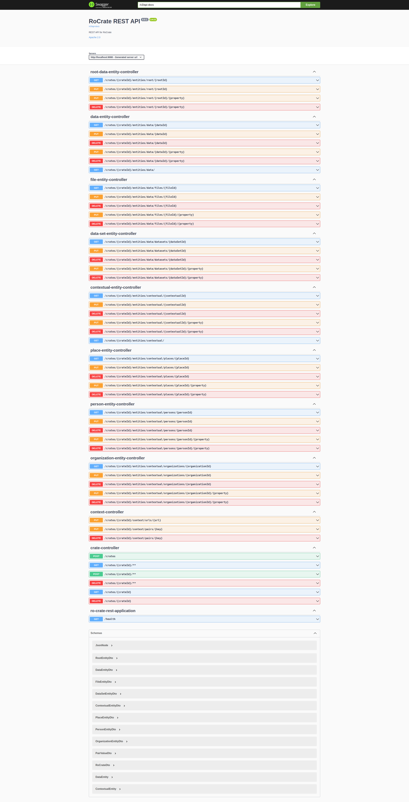

# ro-crate-rest
A RESTful API that aims to mirror the functionality provided by the java library [ro-crate-java](https://github.com/kit-data-manager/ro-crate-java/)


## Installation

```bash
git clone https://github.com/Code42Cate/ro-crate-rest
cd ro-crate-rest
docker build -t ro-crate-rest .
docker run -p 8080:8080 ro-crate-rest
```

You can then visit [swagger-ui](http://localhost:8080/swagger-ui/index.html) to see the documentation.


## Docs Preview




## Note

This is not a production ready service and is a part of [ro-crate-web](https://github.com/Code42Cate/ro-crate-editor)